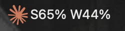
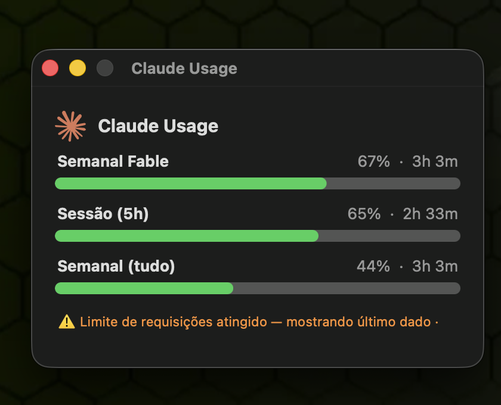
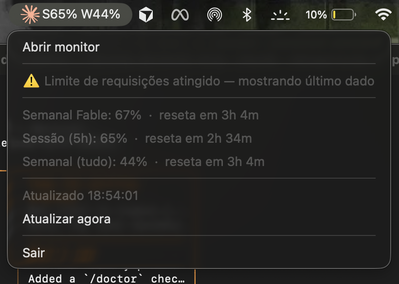

# Claude Usage Monitor for macOS

A lightweight macOS **menu bar app** that shows your Claude usage limits in real
time — session (5h), weekly, and per-model quotas — so you never have to run
`/usage` or dig through settings again.

<p align="center">
  
</p>

<p align="center">
  
  &nbsp;&nbsp;
  
</p>

It reads the exact same data source Claude Code's `/usage` command uses, and
authenticates through your existing Claude Code login. The OAuth token is read
from the macOS Keychain on every refresh — never logged, stored, or sent
anywhere except in the `Authorization` header to `api.anthropic.com`.

> Inspired by [usage-monitor-for-claude](https://github.com/jens-duttke/usage-monitor-for-claude)
> (a Windows tray app) — this is a native macOS menu bar equivalent.

## Features

- **Always in the menu bar** — the Claude logo plus a compact `S45% W42%`
  (`S` = session / 5h, `W` = weekly).
- **Detail window** — click **"Abrir monitor"** for a window with a colored
  progress bar per quota (🟢 `<70%` · 🟠 `70–90%` · 🔴 `>90%`), the current
  percentage, and a countdown to each reset.
- **Dropdown summary** — every active quota and reset time at a glance.
- **Rate-limit friendly** — keeps showing the last known values on a `429` and
  backs off using the server's `Retry-After` (never wipes the numbers).
- **Starts at login** — installed as a LaunchAgent that auto-starts and restarts.
- **Zero config** — uses your existing Claude Code login; no API key to paste.

## Requirements

- macOS
- [Claude Code](https://claude.com/claude-code) installed and logged in
- Python 3.9+ (`python3 --version` — the system or Homebrew build is fine)

## Installation (step by step)

**1. Make sure Claude Code is logged in.** Open a terminal and run `claude`
once; you should reach the prompt without being asked to log in.

**2. Clone the repository.**

```bash
git clone https://github.com/eusoukauecarvalho/claude-usage-monitor-mac.git
cd claude-usage-monitor-mac
```

**3. Run the installer.**

```bash
./install.sh
```

This will:
- create an isolated virtual environment (`.venv/`),
- install the two dependencies (`rumps`, `certifi`),
- register a **LaunchAgent** so the app starts automatically at every login,
- launch it right away.

**4. Look at the top-right of your menu bar.** Within a few seconds the Claude
logo and your usage (`S45% W42%`) appear.

> **Keychain prompt (first run only):** macOS may ask for permission to read the
> `Claude Code-credentials` item from your Keychain. Click **Always Allow** so it
> can refresh silently from then on.

**5. Open the detail window.** Click the menu bar item → **"Abrir monitor"**.

That's it — it will keep running and start again every time you turn on your Mac.

## Usage

- **Left-click** the menu bar item to see all quotas and reset times.
- **"Abrir monitor"** opens the detail window with progress bars.
- **"Atualizar agora"** forces an immediate refresh (auto-refreshes every 90s).
- **"Sair"** quits the current instance.

## Uninstall

```bash
./uninstall.sh   # removes the LaunchAgent (disables autostart) and stops the app
```

Then delete the project folder. Nothing else is left on your system.

## How it works

| Piece        | Detail                                                                      |
| ------------ | --------------------------------------------------------------------------- |
| Data source  | `GET https://api.anthropic.com/api/oauth/usage`                             |
| Auth         | `Authorization: Bearer <token>` + `anthropic-beta: oauth-2025-04-20`        |
| Token source | macOS Keychain item `Claude Code-credentials` → `claudeAiOauth.accessToken` |
| Refresh      | Every 90s; token re-read each cycle so it tracks Claude Code token rotation |
| On `429`     | Keep last values, mark as stale, wait `Retry-After` (default 120s)          |

## About the "Limite de requisições atingido" message

The usage endpoint (`/api/oauth/usage`) **rate-limits how often it can be
called**. It is the same endpoint `/usage` uses, and Anthropic caps the request
frequency per account. If it is polled too often — for example this app running
alongside you manually running `/usage` many times, or several instances at
once — the server replies with HTTP `429 Too Many Requests`.

When that happens you'll see:

> ⚠️ **Limite de requisições atingido — mostrando último dado**

This is **expected and harmless**. The app does not lose your data: it keeps
showing the **last successful percentages** and simply waits before trying
again. Specifically it:

1. reads the server's `Retry-After` header (how long to wait), and
2. backs off for that long (default `120s`) before the next request.

It recovers on its own — no action needed. To reduce how often it appears, raise
`REFRESH_SECONDS` in `monitor.py` (a higher value = fewer requests). Clicking
**"Atualizar agora"** forces an immediate retry, bypassing the backoff.

## Configuration

Edit the constants at the top of `monitor.py`:

- `REFRESH_SECONDS` — polling interval (default `90`)
- `WARN_THRESHOLD` / `CRIT_THRESHOLD` — the 🟠 / 🔴 cutoffs (default `70` / `90`)
- `DEFAULT_RETRY_AFTER` — backoff when a `429` has no `Retry-After` (default `120`)

Restart the app after editing — re-run `./install.sh`, or:

```bash
launchctl kickstart -k "gui/$(id -u)/com.claude.usagemonitor"
```

## Notes

- **UI language:** menu and window labels are currently in Portuguese
  (`Sessão`, `Semanal`, `Abrir monitor`, …). PRs to internationalize are welcome.
- **Logo/trademark:** the Claude logo belongs to Anthropic and is bundled only
  for personal convenience.

## Disclaimer

Unofficial, community-built tool. Not affiliated with or endorsed by Anthropic.
It uses the same authenticated endpoint Claude Code itself calls, but that
endpoint is undocumented and may change.

## License

[MIT](LICENSE) © 2026 Kauê Carvalho
